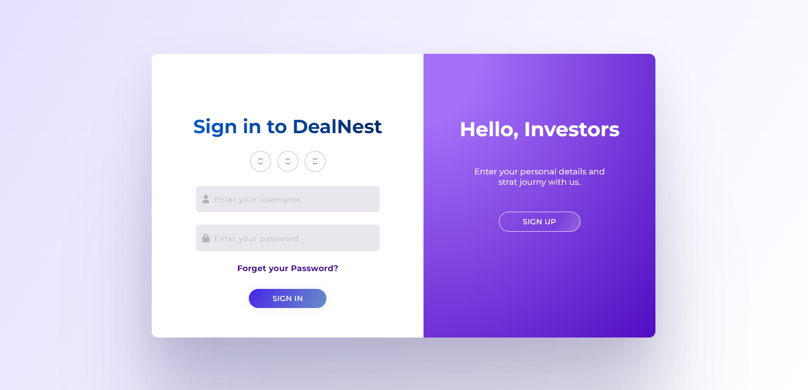
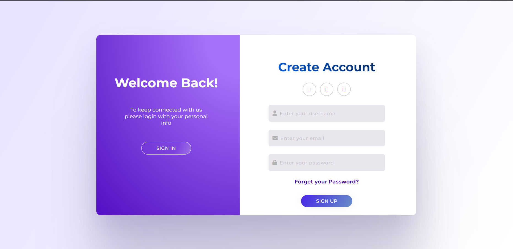

# FundIt - Investor & Entrepreneur Platform

## Description
**FundIt** is a web-based platform that enables investors to browse, explore, and invest in entrepreneurial projects. The platform provides an intuitive and responsive UI, allowing entrepreneurs to showcase their ideas while investors can easily find potential investment opportunities.

## Features
- ✅ **Project Listings** – Browse and explore projects from different industries.
- ✅ **Investor Dashboard** – A clean and organized UI for investors to track potential projects.
- ✅ **Entrepreneur Profiles** – View entrepreneur details and their project descriptions.
- ✅ **Modern UI** – Built with **Angular Material** for a sleek and responsive experience.
- ✅ **Client-Side Routing** – Smooth navigation with Angular Router.
- ✅ **SSR Support** – Server-side rendering enabled for better performance and SEO.
- ✅ **Bootstrap Icons** – Lightweight and elegant icons for UI elements.

## Tech Stack
- **Framework:** Angular 19
- **UI Library:** Angular Material
- **Icons:** Bootstrap Icons
- **State Management:** Services-based state
- **SSR:** Angular Universal
- **Server (for SSR):** Express.js

## Screenshots

### 1. Home Page


### 2. Landing Page


### 3. Popups


### 4. Login


### 5. Sign In


### 6. User Type


## Installation & Setup

### 1. Clone the Repository
```bash
git clone https://github.com/Iheb-Zenkri/Angular.git
cd fundit
```
## 2. Install Dependencies

```bash
npm install
```
## 3. Run the Development Server

```bash
npm start
```

## 4. Build for Production

```bash
ng build
```

## 5. Run with Server-Side Rendering (SSR)

```bash
npm run serve:ssr:fundit
```
